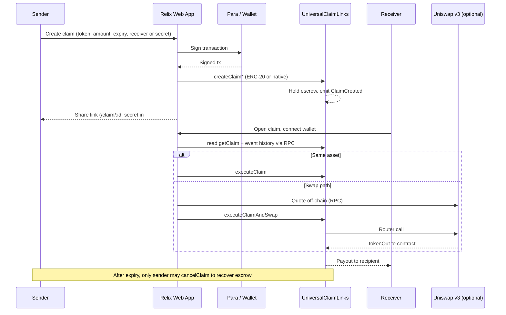

# Relix (Universal Claim Links on Monad)

**Relix** is **shareable claim links** on **[Monad](https://monad.xyz)**: funds stay in a **contract** until the right person **claims** before **expiry**—typically as the **same token** (**MON** or **USDC**), or as **another token** via **Uniswap v3** where swaps are live. Wallets and signing use **[Para](https://docs.getpara.com/)**.

---

## At a glance

- Lock **MON** or **USDC** (or extra tokens via env); **receiver address** or **open** claim with **secret** in the URL `#` fragment.
- **One claim** while open & not expired: **1:1 payout** or **swap + claim** if quotes work on your network.
- **No backend DB** for history—the app reads **chain events** + **`getClaim`** (see *Where history lives*).
- New **deploy = new contract**; old links still point at the contract they were created on.

---

## Features

- On-chain escrow with **expiry** and **sender cancellation after expiry** (`cancelClaim`).
- **Address-locked** claims (only the designated receiver executes) and **open / secret** claims (anyone with the secret; executor becomes the recorded receiver).
- **Direct claim** (`executeClaim`): payout **must** match escrowed asset (`tokenOut == tokenIn`, including native `address(0)` for MON).
- **Claim + swap** (`executeClaimAndSwap`): uses an aggregator quote (Uniswap v3 router calldata) executed by the contract, then delivers `tokenOut` to the recipient.
- Web app: **Create**, **Claim**, and receipts-style listing fed **only from Monad** (plus optional explorer links after settlement).
- **Para** for embedded and external wallets (MetaMask, Phantom; optional WalletConnect when configured).

---

## Verified / deployed contract

There is **no single canonical address** in this repo—you deploy `UniversalClaimLinks` yourself (or use an address your team agrees on). After deployment:

1. Put the address in **`VITE_UNIVERSAL_CLAIM_LINKS_ADDRESS`** (see `.env.example`).
2. Verify it on the explorer for your chain (testnet vs mainnet) using your toolchain’s verify flow.

Use Monad’s explorers, e.g. [Monad testnet explorer](https://testnet.monadexplorer.com/) / [mainnet](https://monadexplorer.com/), depending on `VITE_CHAIN_ID`.

---

## On-chain rules (what the contract enforces)

- **Escrow**: `tokenIn` and amounts are fixed at creation; funds stay in the contract until **executed** or **cancelled after expiry**.
- **Expiry**: `executeClaim` / `executeClaimAndSwap` require `block.timestamp < expiry`. After expiry, **only the sender** may `cancelClaim` and recover escrow.
- **Who may execute**
  - **Locked** (`secretHash == 0`): `msg.sender` must be `receiver`.
  - **Open** (`secretHash != 0`): caller must supply `secret` with `keccak256(secret) == secretHash`; receiver is set to `msg.sender` on success.
- **Direct vs swap**
  - `executeClaim` **reverts** if `tokenOut != tokenIn` (`TokenOutMismatch`).
  - `executeClaimAndSwap` performs the external call to `swapTo` with the quoted calldata and sends the resulting `tokenOut` (or native) to `recipient`.
- **Operations**: `owner` can **pause** / **unpause**; ownership can be transferred.

---

## Design choices (why it works this way)

- **Link = id (+ fragment)**: The shareable URL carries a **claim id**; open claims also put the **secret after `#`** so typical HTTP logs and referrers do not see it as a path segment.
- **No backend for truth**: Custody and balances live in the contract; the UI **reconstructs** activity from **events + reads**, so there is no Supabase or server to trust for “who owns which claim.”
- **Refunds are manual**: Nothing auto-returns funds at expiry; the sender must call **`cancelClaim`** after the deadline.
- **Swaps depend on chain conditions**: Quoting uses **Uniswap v3** addresses for Monad; on some environments (especially **testnet**) published router addresses may have **no code** until redeploys—same-asset **MON** claims still work without DEX.

---

## Project structure

```text
Relix/
├── src/UniversalClaimLinks.sol     # Escrow + executeClaim / executeClaimAndSwap
├── test/UniversalClaimLinks.t.sol  # Forge tests
├── script/
│   └── DeployUniversalClaimLinks.s.sol
├── scripts/
│   ├── deploy-env.sh               # Deploy using PRIVATE_KEY in .env
│   ├── doctor.sh                   # Quick health checks
│   └── sync-universal-claim-abi.mjs
├── lib/                            # Foundry deps (OpenZeppelin, forge-std, …)
├── foundry.toml
├── package.json                    # Root: compile, test, deploy scripts
├── .env.example
└── frontend/
    ├── src/
    │   ├── components/app/         # Create / Claim / Receipts (app shell)
    │   ├── components/landing/     # Marketing sections
    │   ├── hooks/                  # Para + viem
    │   ├── lib/
    │   │   ├── claims/             # On-chain history (getLogs + getClaim)
    │   │   ├── contracts/        # ABI, env, token helpers
    │   │   ├── viem/             # Chain + RPC helpers
    │   │   └── uniswapV3MonadSwap.ts
    │   ├── pages/
    │   ├── providers/
    │   └── public/tokens/          # Local MON / USDC artwork (optional)
    ├── vite.config.ts
    ├── package.json
    └── .env.example
```

---

## Architecture (high level)



---

## Tech stack

| Layer | Choice |
|--------|--------|
| Smart contracts | Solidity **0.8.24**, OpenZeppelin, **Foundry** (Forge) for build & test |
| Web app | **React**, **Vite**, **TypeScript**, **Tailwind** |
| Wallets | **Para** (`@getpara/react-sdk`) |
| Chain I/O | **viem** |
| Swaps | **Uniswap v3** (QuoterV2 + SwapRouter02) on Monad where deployed |

---

## Prerequisites

- **Node.js** ≥ 18  
- **pnpm** for `frontend/` (required there)  
- **Foundry** (`forge`, `cast`, `anvil`) for contracts  
- **Para** API key for the web app (`VITE_PARA_API_KEY`)  
- **MON** (and tokens you test with) on your target Monad network  
- Optional: **WalletConnect** project id if you enable it in the app  

---

## Quick start (from scratch)

### 1) Install toolchains

**Repo root** (optional `pnpm install` for npm scripts that wrap Forge):

```bash
pnpm install
```

**Frontend:**

```bash
cd frontend
pnpm install
```

### 2) Environment files

Copy examples:

```bash
cp .env.example .env
cd frontend && cp ../.env.example .env
```

Vite merges env from **parent** `Relix/.env` and **`frontend/.env`**; **`frontend/.env` wins** on duplicate keys. All browser-visible vars must be prefixed with **`VITE_`**.

**Minimum for the app:**

```env
VITE_PARA_API_KEY=...
VITE_UNIVERSAL_CLAIM_LINKS_ADDRESS=0x...   # after you deploy
VITE_CHAIN_ID=10143                         # or 143 for mainnet
```

See **`.env.example`** for RPC, USDC address, Uniswap overrides, `VITE_CLAIMS_FROM_BLOCK`, and optional extra payout tokens.

**Deploy key (root `.env` only, never commit):**

```env
PRIVATE_KEY=0x...
```

Restart **`pnpm dev`** whenever you change `VITE_*`.

### 3) Compile contracts + sync ABI

From **repo root**:

```bash
pnpm run compile
```

This runs `forge build` and copies the ABI into the frontend.

### 4) Test

```bash
pnpm run test
```

### 5) Deploy to Monad

Recommended (uses `PRIVATE_KEY` in `.env`):

```bash
pnpm run deploy:env
```

**Important:** when passing Forge flags through npm, do **not** add an extra `--` immediately before `--private-key` or `--account`; that can break script argument encoding.

Copy the deployed address into **`VITE_UNIVERSAL_CLAIM_LINKS_ADDRESS`**. Sanity check:

```bash
pnpm run doctor
```

### 6) Run the web app

```bash
cd frontend
pnpm dev
```

Production build (needs extra Node heap for this bundle):

```bash
pnpm run build
```

---

## Scripts reference

### Root (`Relix/package.json`)

| Script | Purpose |
|--------|---------|
| `pnpm run compile` | `forge build` + sync ABI to frontend |
| `pnpm run compile:clean` | `forge clean`, build, sync ABI |
| `pnpm run sync:abi` | Build + sync ABI |
| `pnpm run test` / `test:vv` | Forge tests |
| `pnpm run deploy` | Broadcast deploy script (pass wallet flags after `--`) |
| `pnpm run deploy:env` | Deploy using `PRIVATE_KEY` from `.env` |
| `pnpm run deploy:dry` | Simulate deploy |
| `pnpm run deploy:anvil` | Deploy to local Anvil |
| `pnpm run doctor` | Bytecode / env sanity helper |

### Frontend (`frontend/package.json`)

| Script | Purpose |
|--------|---------|
| `pnpm dev` | Dev server |
| `pnpm build` | Production build |
| `pnpm preview` | Preview build |
| `pnpm lint` | ESLint |
| `pnpm test` | Vitest |

---

## Where “history” lives

The **Receipts / listings** UI does **not** read a hosted database. It:

1. Queries **`ClaimCreated`** / **`ClaimExecuted`** / **`ClaimCancelled`** logs for your `VITE_UNIVERSAL_CLAIM_LINKS_ADDRESS`, and  
2. Calls **`getClaim`** for each relevant `claimId`.

Set **`VITE_CLAIMS_FROM_BLOCK`** to your contract deployment block (or earlier) if scanning from block `0` is too heavy for your RPC.

---

## Claim flow

### Create

1. Connect with Para.  
2. Choose **MON** or **USDC**, amount, expiry.  
3. Choose **receiver address** or **open (secret)** flow.  
4. Submit the **create** transaction.  
5. Share the in-app link (`/claim/<id>`; for open claims, append `#<secret>`).

### Claim

1. Open the link or search by id.  
2. Ensure the connected wallet matches the claim (or supply the secret for open claims).  
3. Choose **Receive as** — **same asset** (direct) or **swap** when Uniswap is available on your chain.  
4. Execute; use **View on explorer** when the UI shows a settlement tx.

---

## Uniswap & testnet caveats

Published [Uniswap Monad deployment](https://docs.uniswap.org/contracts/v3/reference/deployments/monad-deployments) addresses are reliable on **mainnet (`143`)** for many setups. On **testnet (`10143`)**, the same addresses may have **no bytecode** after a reset—**swap quotes fail** until Monad publishes new testnet addresses (then set `VITE_UNISWAP_V3_*_10143` in `.env`). **Direct native MON claims** do not require Uniswap.

---

## Troubleshooting

| Symptom | Things to check |
|---------|------------------|
| Para / wallet flaky | `VITE_PARA_API_KEY`, optional `VITE_PARA_ENV`, restart dev server after env edits |
| Wrong network | `VITE_CHAIN_ID`, RPC URL, and wallet network must match deployment |
| Claim reverts | Receiver or secret, not expired/open, correct `tokenOut` for direct claim |
| Swap quote errors | Uniswap deployment on that chain; try same-asset claim or mainnet |
| RPC `413` / timeouts | Narrow history with `VITE_CLAIMS_FROM_BLOCK`; retry or use a dedicated RPC |
| ABI out of date | `pnpm run compile` after Solidity changes |

---

## Security notes

- Never commit **private keys** or **service-role** secrets.  
- Anything prefixed **`VITE_`** is exposed in the browser bundle—treat it as public.  
- Prefer **anon / publishable** keys only for any future backend; this repo’s claim list does not require them today.

---

## License

SPDX **`MIT`** on `UniversalClaimLinks.sol`. If you add a root `LICENSE` file for the whole repo, keep it consistent with dependencies under `lib/`.

---

## Links

- [Monad documentation](https://docs.monad.xyz)  
- [Foundry Book](https://book.getfoundry.sh/)  
- [Para documentation](https://docs.getpara.com/)  
- [Uniswap v3 – Monad deployments](https://docs.uniswap.org/contracts/v3/reference/deployments/monad-deployments)  
